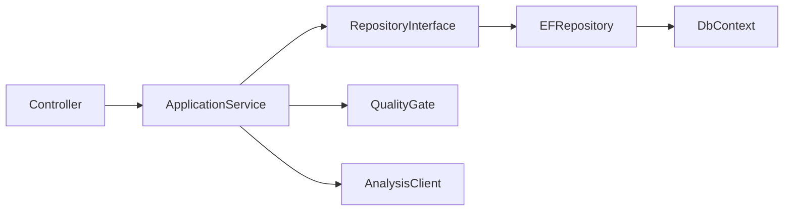

# コンポーネント図

```mermaid
flowchart LR
 Controller --> ApplicationService
 ApplicationService --> RepositoryInterface
 ApplicationService --> QualityGate
 RepositoryInterface --> EFRepository
 EFRepository --> DbContext
 ApplicationService --> AnalysisClient
```

Domainは外部技術へ依存せず、InfrastructureがApplicationのInterfaceを実装します。
