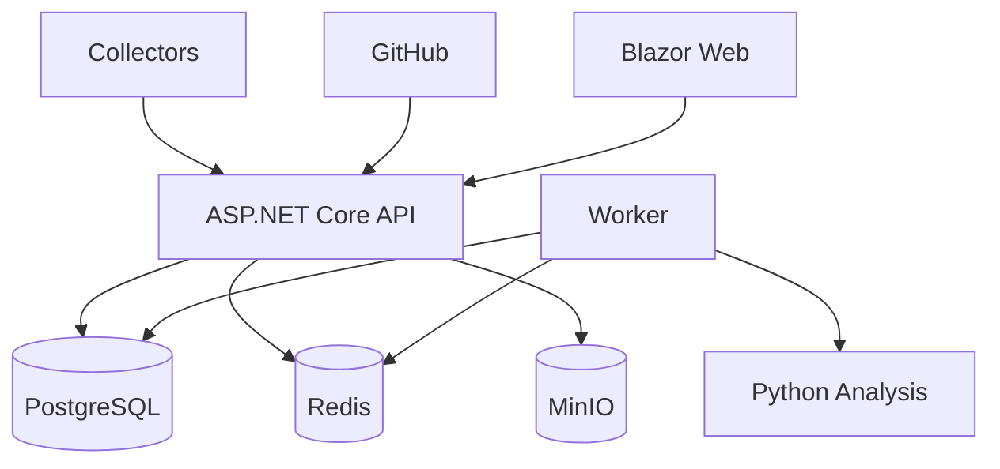

# Container Diagram

```mermaid
flowchart TB
 C[Collectors] --> A[ASP.NET Core API]
 G[GitHub] --> A
 A --> P[(PostgreSQL)]
 A --> R[(Redis)]
 W[Worker] --> R
 W --> P
 W --> PY[Python Analysis]
 B[Blazor Web] --> A
 A --> M[(MinIO)]
```
