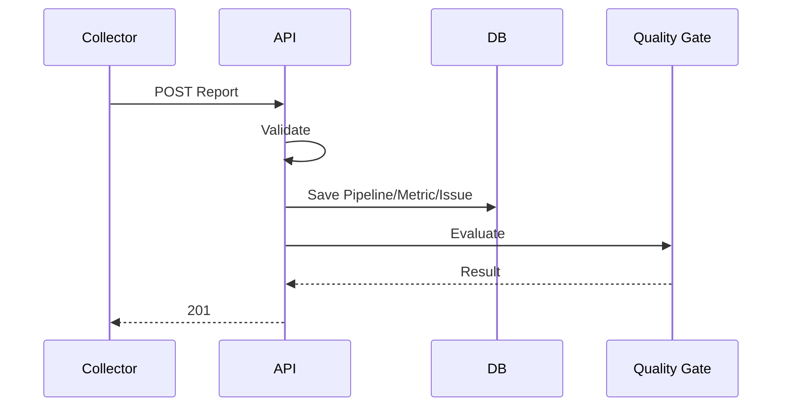

# Data Flow

```mermaid
sequenceDiagram
 participant C as Collector
 participant A as API
 participant D as DB
 participant Q as Quality Gate
 C->>A: POST Report
 A->>A: Validate
 A->>D: Save Pipeline/Metric/Issue
 A->>Q: Evaluate
 Q-->>A: Result
 A-->>C: 201
```
