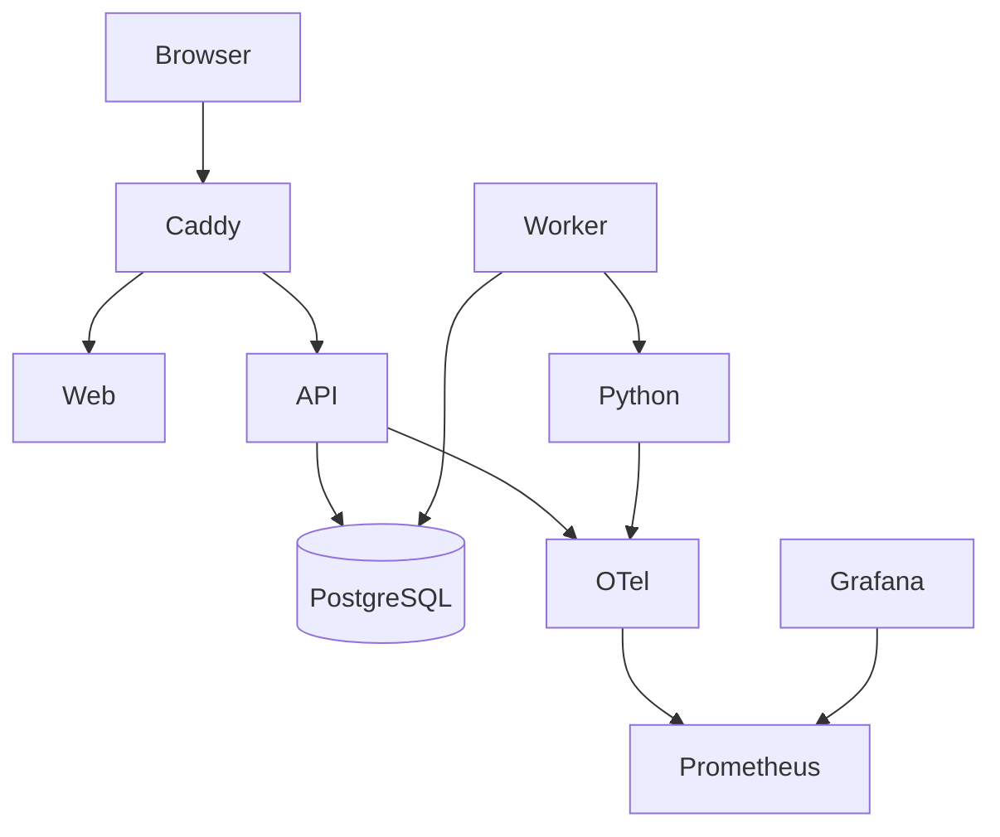

# デプロイ構成

```mermaid
flowchart TB
 U[Browser] --> C[Caddy]
 C --> W[Web]
 C --> A[API]
 A --> P[(PostgreSQL)]
 K[Worker] --> P
 K --> PY[Python]
 A --> O[OTel]
 PY --> O
 O --> PR[Prometheus]
 G[Grafana] --> PR
```
